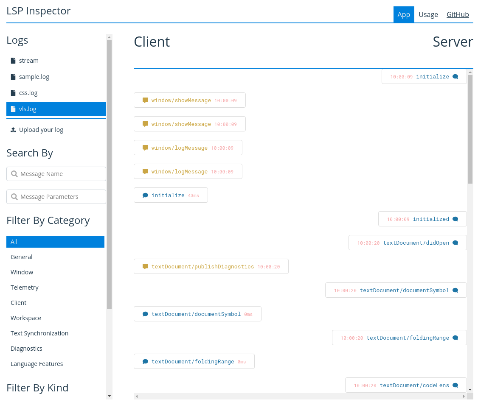

> VLS is a work-in-progress, pre-alpha language server. It may not be guaranteed to work reliably on your system due to memory management issues and other factors.

# vls
[](https://github.com/vlang/vls/actions/workflows/ci.yml)

VLS (V Language Server) is a LSP v3.15-compatible language server for [the V programming language](https://github.com/vlang/v).

## Installation
Installation requires you to have Git and V installed and compile the language server by yourself. You need to execute the following:
```
git clone https://github.com/vlang/vls.git vls && cd vls/

# Build the project
v -prod cmd/vls
# The binary will be create in the subfolder by default
```

## Usage
> **NOTE:** VLS only officially supports VSCode for now ([vls#52](https://github.com/vlang/vls/issues/52)).

In order to use the language server, you need to have a text editor with support for LSP. In this case, the recommended editor for testing (for now) is to have [Visual Studio Code](https://code.visualstudio.com) and the [vscode-vlang](https://github.com/vlang/vscode-vlang) extension version 0.1.4 or above installed.


Afterwards, go to your editor's configuration and scroll to the V extension section. From there, enable VLS by checking the box and input the absolute path of the `vls` language server executable. If you cloned the repository and compiled it from source, the executable will be in the `cmd/vls` directory. So make to add `cmd/vls/vls`.

## Roadmap
- [ ] Queue support (support for cancelling requests)

### General
- [x] `initialize` (Activates features based on VSCode's capabilities for now.)
- [x] `initialized`
- [x] `shutdown`
- [x] `exit`
- [ ] `$/cancelRequest`
<!-- - [ ] `$/progress` -->
### Window
- [x] `showMessage`
- [x] `showMessageRequest`
- [x] `logMessage`
- [ ] `progress/create`
- [ ] `progress/cancel`
### Telemetry
- [ ] `event` (Implemented but not usable)
### Client
- [ ] `registerCapability`
- [ ] `unregisterCapability`
### Workspace
- [ ] `workspaceFolders`
- [ ] `didChangeWorkspaceFolder`
- [ ] `didChangeConfiguration`
- [ ] `configuration`
- [ ] `didChangeWatchedFiles`
- [x] `symbol`
- [ ] `executeCommand`
- [ ] `applyEdit`
### Text Synchronization
- [x] `didOpen`
- [x] `didChange`
- [ ] `willSave`
- [ ] `willSaveWaitUntil`
- [ ] `didSave`
- [x] `didClose`
### Diagnostics
- [x] `publishDiagnostics`
### Language Features
- [x] `completion`
- [ ] `completion resolve`
- [x] `hover`
- [x] `signatureHelp`
- [ ] `declaration`
- [x] `definition`
- [ ] `typeDefinition`
- [ ] `implementation`
- [ ] `references`
- [ ] `documentHighlight`
- [x] `documentSymbol`
- [ ] `codeAction`
- [ ] `codeLens`
- [ ] `codeLens resolve`
- [ ] `documentLink`
- [ ] `documentLink resolve`
- [ ] `documentColor`
- [ ] `colorPresentation`
- [x] `formatting`
- [ ] `rangeFormatting`
- [ ] `onTypeFormatting`
- [ ] `rename`
- [ ] `prepareRename`
- [x] `foldingRange`

## Debugging
> By default, log can only be accessed and saved on server crash. To save the log on exit, pass the `--debug` flag to the language server CLI. 

VLS provides a log file (`${workspacePath}/vls.log`) for debugging language server for certain situations (e.g unexpected crash). To read the contents of the `vls.log` file, simply upload the file to the [LSP Inspector](https://iwanabethatguy.github.io/language-server-protocol-inspector/) and select `vls.log`. 



### Error Reporting
If you encounter a crash in the language server, be sure to attach the `vls.log` file when [submitting an issue](https://github.com/vlang/vls/issues/new).

# Contributing
## Submitting a pull request
- Fork it (https://github.com/vlang/vls/fork)
- Create your feature branch (git checkout -b my-new-feature)
- Commit your changes (git commit -am 'Add some feature')
- Push to the branch (git push origin my-new-feature)
- Create a new Pull Request

# Contributors
- [nedpals](https://github.com/nedpals) - creator and maintainer
- [danieldaeschle](https://github.com/danieldaeschle) - maintainer
