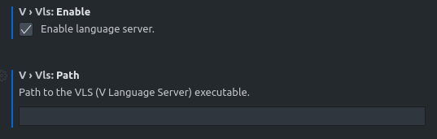

> ## ⚠️ Warning (Please read this first) ⚠️
> What you're seeing is the developmental branch of the V Language server. This means that it may not be guaranteed to work reliably on your system.
>
> If you are experiencing problems, please consider [filing a bug report](#error-reporting).

# V Language Server
[](https://github.com/vlang/vls/actions/workflows/ci.yml)

V Language Server (also known as "VLS") is a LSP v3.15-compatible language server for [the V programming language](https://github.com/vlang/v).

## What is a language server?
A language server is a software that understands the code provided by the user and provides information to supported text editors and IDEs. Think of it as a compiler that does not emit an executable but a format that your text editor can use in order for you to work on a project better and faster.

Some of the commonly used features such as autocompletion / IntelliSense, go to definition, and diagnostics are directly handled by the language server itself and not by the dedicated language extensions.

## What does it support?
Currently, VLS supports the following language features:

| **Feature Name** | **Supported?** | **Notes** |
|------------------|----------------|-----------|
| Diagnostics | ✅ | Via `v -check` |
| Completion | ✅ | Needs polish |
| Hover | ✅ | |
| Signature Help | ✅ | |
| Go to Declaration | ❌ | |
| Go to Definition | ✅ | |
| Go to Implementation | ✅ | Limited to interfaces for now. |
| References | ❌ | |
| Document Highlight | ❌ | |
| Code Action | ❌ | |
| Document Symbol / Outline | ✅ | |
| Workspace Symbols | ✅ | Limited to opened documents. |
| Document Link | ✅ | Stub implementation |
| Formatting | ✅| Via `v fmt` |
| Range Formatting | ❌ | |
| Type Formatting | ❌ | |
| Rename | ❌ | |
| Folding Range | ✅ | |

For a full list of features/methods VLS supports, see[CAPABILITIES.md](CAPABILITIES.md).

# Installation
You can get the V language server on a variety of methods.

## Pre-built/Precompiled Binaries (Recommended)
Pre-built binaries for Windows (x64), MacOS (x64/M1), and Linux (x64) can be found [here](https://github.com/vlang/vls/releases/latest).

## VSCode
The official [V VSCode extension](https://github.com/vlang/vscode-vlang) provides built-in support for VLS. To install VLS, go to the V section of your editor's settings and check the "Enable VLS" setting. This will look for any existing installation of VLS and will download a copy if there's none.

If you want to use an existing copy of VLS, please refer to this [guide](#vscode-vscodium-and-other-derivatives).

## Build from Source
> **NOTE**: TCC, the default compiler shipped with V, is not recommended ATM due to
> some issues in the Tree Sitter's output.

To build the language server from source, you need to have the following:
- GCC/Clang (Latest),
- [Git](https://git-scm.com/download)
- [V](https://github.com/vlang/v) (0.2.2 and later).

> **NOTE**: If you are downloading V from [Homebrew](https://brew.sh) 
> and other community-maintained packages, please do `v up` first
> before proceeding.

Afterwards, open your operating system's terminal and execute the following:
```
## Clone the project:
git clone https://github.com/vlang/vls && cd vls

## Build the project
## Use "v run build.vsh gcc" if you're compiling VLS with GCC.
v run build.vsh clang

# The binary will be created in the `bin` directory inside the vls folder.
```

# Usage
To use the language server, you need to have an editor with [LSP](https://microsoft.github.io/language-server-protocol/) support. See [this link](https://microsoft.github.io/language-server-protocol/implementors/tools/) for a full list of supported editors.

## VSCode, VSCodium, and other derivatives
> [GitHub Web Editor](https://github.dev) and [VSCode Online](https://vscode.dev) are not supported yet at this moment. See this [issue comment](https://github.com/vlang/vscode-vlang/issues/272#issuecomment-898271911).

For [Visual Studio Code](https://code.visualstudio.com) and other derivatives, all you need to do is to install 0.1.4 or above versions of the [V VSCode extension](https://github.com/vlang/vscode-vlang). Afterwards, go to settings and scroll to the V extension section. From there, enable VLS by checking the "Enable VLS" box.

If you have VLS downloaded in a custom directory, you need to input the absolute path of the `vls` language server executable to the "Custom Path" setting. If you cloned the repository and compiled it from source, the executable will be in the `vls` root directory. So make sure to add `vls/bin/vls` or `vls/bin/vls.exe` (for Windows).



## Sublime Text (3 and 4)
For Sublime Text, please install the [LSP extension](https://packagecontrol.io/packages/LSP) via [Package Control](https://packagecontrol.io). Afterwards, open the command palette, select `Preferences: LSP Settings`, and add the following configuration:
```json
{
    "clients": {
        "vls": {
            "enabled": true,
            "command": ["<vls-dir>/vls"],
            "selector": "source.v"
        }
    }
}
```

If you cloned the repository and compiled it from source, the executable will be in the `vls` root directory. So make sure to set the `command` array to `vls/bin/vls` or `vls/bin/vls.exe` (for Windows).

## Vim
For Vim, please install [vim-lsp](https://github.com/prabirshrestha/vim-lsp) and [vim-lsp-settings](https://github.com/mattn/vim-lsp-settings). Afterwards, open any `.v` file, and execute `:LspInstallServer`.

## IntelliJ IDEA, GoLand, and other derivatives
VLS on JetBrain / IntelliJ-based IDEs does not work at this moment. See [issue 52](https://github.com/vlang/vls/issues/52) for more details.

## Other Editors
For other editors, please refer to the plugin's/editor's documentation for instructions on how to setup an LSP server connection.

## Crash Reports
VLS generates a report and notifies the user by default when something is wrong. These crash reports are accessible which can be found inside `C:\Users\<user_name\.vls\reports` for Windows and `~/.vls/reports` for both Linux and MacOS. The contents of the file can be then pasted into the [issue tracker form](https://github.com/vlang/vls/issues/new).

Bugs that are not crashes however can still generate reports by passing the `--generate-report` flag to the language server CLI.

## Logging
VLS provides a log file (`${workspacePath}/vls.log`) for debugging the language server incoming requests and outgoing responses / notifications. By default, this can only be saved and accessed on server crash. To save the log on every exit, pass the `--debug` flag to the language server CLI.

# Contributing
## Submitting a pull request
- Fork it (https://github.com/vlang/vls/fork)
- Create your feature branch (git checkout -b my-new-feature)
- Commit your changes (git commit -am 'Add some feature')
- Push to the branch (git push origin my-new-feature)
- Create a new Pull Request

# Contributors
- [nedpals](https://github.com/nedpals) - creator and maintainer
- [danieldaeschle](https://github.com/danieldaeschle) - maintainer
- [hungrybluedev](https://github.com/hungrybluedev) - contributor
- [streaksu](https://github.com/streaksu) - contributor
- [ylluminarious](https://github.com/ylluminarious) - contributor
- [yuyi98](https://github.com/yuyi98) - contributor
