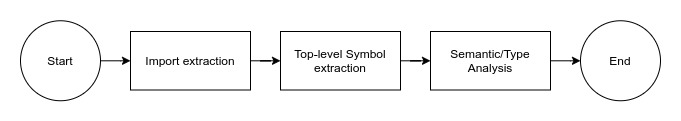

# analyzer
## What
A VLS submodule dedicated for analyzing and extracting information from the [Tree-sitter](https://tree-sitter.github.io/tree-sitter/) trees. 

## Why
We're using the Tree-sitter parser to gracefully handle such operations that the current V tooling cannot do at this moment and because of this, we are recreating the whole process due to its incompatibility with the existing tools.

## How
By using the [tree traversal](https://tree-sitter.github.io/tree-sitter/using-parsers#walking-trees-with-tree-cursors) and [node retrieval](https://tree-sitter.github.io/tree-sitter/using-parsers#syntax-nodes) operations provided by the Tree-sitter API, we can extract information about a specific symbol and use it for later use (autocompletion, goto definition, and etc.)

## Functions
The analyzer module does a variety of things required for understanding V code:
1. Symbol registration
2. Semantic/type analysis (aka diagnostics).
3. Import analysis / module importation

## Flow

1. Import Analysis / Module Importation
  - Scans the import nodes and list them inside an import list.
  - Resolves the scanned imports by looking up the locations and registers them to a shared dependency graph.
  - Imports the resolved imports.
  - Clean up unused imports.
2. Top-level Symbol declaration
  - Registers all the top-level nodes (enums/functions/structs/consts/globals) into the store.
  - Creates a scope tree for each block (except for the imported ones)
3. Semantic / type checking
  - Follows the rules implemented in `v.checker`

## Architecture
- It strives to be modular as much as possible and provides abstractions for easy debugging and testing.
- It does not have dependencies in other VLS-specific modules with the exception of the Tree-sitter module.
## Other Implementation Notes
1. The `builtin` module and it's symbols are not automatically imported by the analyzer. They are therefore done by the consumers (tests, programs, applications) as they are the ones who know the exact location of it.
2. "Compiler magic"-specific features are handled.
3. Translation of data such as position information and more are handled by the consumers of the module which is in this case is VLS.
  - By "consumers", it means that it can be used outside VLS.
4. IDE-specific features such as autocompletion are not handled by analyzer. Instead they are handled by VLS.